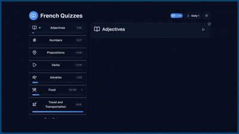

# QuickFrench 🇫🇷

QuickFrench is a focused, interactive app for mastering French vocabulary through fast quiz loops. It offers multiple‑choice and typing modes, bi‑directional translation, and on‑device caching so practice feels instant—online or offline.

## Demo (Images)

<!-- Replace public/demo.gif with a real recording of a short quiz session. -->



## Examples

QuickFrench — A lightning‑fast French vocabulary trainer with multiple‑choice and typing modes, bi‑directional translation, and offline‑friendly caching.

## What you get

- Interactive quiz engine: Multiple‑choice and typing
- Bi‑directional translation: French ↔ English
- Topic packs: adjectives, numbers, prepositions, verbs, adverbs, food, travel & transportation, body parts & health
- Category‑aware food vocabulary (fruits, vegetables, drinks, etc.)
- Real‑time score, streaks, and progress
- Keyboard shortcuts and optional auto‑advance for tight practice loops
- Responsive, mobile‑friendly UI

## Why?

I wanted short, high‑tempo vocab reps that didn’t fight me. The popular tools I tried were slow to start, packed with distractions, and often served irrelevant options. On flaky Wi‑Fi, they stalled right when I had 2 minutes to practice. So I built QuickFrench: a keyboard‑first trainer that keeps you in flow—fast to start, fast to answer, and smart about the words it shows.

Guiding principles

- Speed: Instant feel with offline‑friendly caching; minimal waits between questions.
- Focus: No feeds, no fluff. Clean UI, keyboard shortcuts, and optional auto‑advance to reduce friction.
- Relevance: Topic packs and category‑aware distractors keep multiple‑choice options meaningful.
- Flow: Bi‑directional translation, quick restarts (R), and tight feedback loops encourage repeat sessions.
- Curriculum: This is taken right off of Cambridge's French as a Foreign Language Syllabus document.

## Quick start

Prerequisites
**Disclaimer**: This project is not meant to be run locally. You can use QuickFrench for completely free on [quickfrench.vercel.app](https://quickfrench.vercel.app)

- Bun installed (https://bun.sh)
- Turso database (URL + Auth Token)

1. Clone

```bash
git clone https://github.com/Shoaib-Programmer/quickfrench.git
cd quickfrench
```

2. Install dependencies

```bash
bun install
```

3. Configure environment
   Create a `.env.local` file in the project root:

```env
TURSO_DATABASE_URL=your_turso_database_url
TURSO_AUTH_TOKEN=your_turso_auth_token
```

4. Run the app

```bash
bun dev
```

Open http://localhost:3000

## How to use

1. Pick a topic

- Adjectives, Numbers, Prepositions, Verbs, Adverbs, Travel & Transportation, or Food (with categories)

2. Configure the session (Settings at /settings)

- Mode: Multiple Choice or Typing
- Direction: French → English or English → French
- Question count: 5, 10, 15, 20, All, or custom
- Auto‑advance: jump ahead after a correct answer

3. Play

- Multiple Choice: click an option (or press 1–4)
- Typing: type your answer and press Enter
- Press Space/Enter to continue when results are shown
- Press R to restart anytime (outside the topic selector)

Your preferences (mode, count, direction, auto‑advance) are saved locally.

### Data & caching

- Next.js API routes backed by Turso (@libsql)
- Client‑side caching via IndexedDB (Dexie) with 24‑hour TTL and stale‑while‑revalidate
- Settings page lets you refresh from DB or clear the cache

### Expected tables

- adjectives, numbers, prepositions, verbs, adverbs, transportation, food, food_categories, body, body_categories
- Minimal columns: `word` (TEXT), `meaning` (TEXT); category‑based tables include a category reference

## Tech stack

- Next.js 15, React 19, TypeScript
- Tailwind CSS 4
- Turso (@libsql) for database
- Dexie (IndexedDB) for offline‑friendly caching
- Lucide React for icons
- Bun for package management and dev server

## Scripts

- `bun dev` — Start dev server (Turbopack)
- `bun build` — Production build
- `bun start` — Run production server
- `bun lint` — ESLint
- `bun run typecheck` — TypeScript typecheck

## Contributing

We welcome improvements:

1. Fork the repo
2. Create a branch: `git checkout -b feature/your-idea`
3. Commit: `git commit -m "feat: add your idea"`
4. Push: `git push origin feature/your-idea`
5. Open a Pull Request with context and screenshots (if UI)

Tips

- Keep PRs small and focused
- Add/adjust types when you change public shapes
- If touching API routes, note any schema assumptions

## License

Private project. All rights reserved.

## Links

- Turso Database — https://turso.tech/
- Next.js — https://nextjs.org/
- Tailwind CSS — https://tailwindcss.com/

— Made with ❤️ by Shoaib and Sarthak

Note: A service worker for full offline shell is available now!
